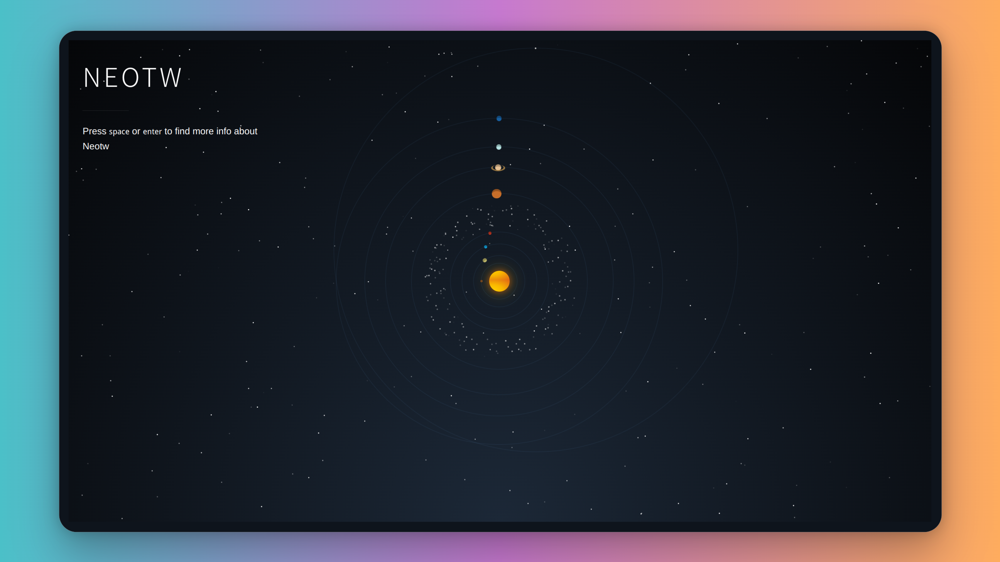

<div align="center">

<h1>Neotw</h1>


</div>

<!-- badges -->
<a href="https://gitter.im/oeyoews/neotw?utm_source=badge&utm_medium=badge&utm_campaign=pr-badge&utm_content=badge" target="_blank">
  
</a>
<a href="https://github.com/oeyoews/neotw" target="_blank">
  
</a>
<a href="https://github.com/oeyoews/neotw" target="_blank">
  
</a>
<a href="https://github.com/oeyoews/neotw" target="_blank">
  
</a>

## What's the neotw

> A modern style notebook based on `tiddlywiki`

## 🖼️ ShowCases

<center>


</center>

<!-- ## Features -->

<!-- - 一键部署 -->

## Deploy

<!-- https://vercel.com/docs/deploy-button -->
<a target="_blank" href="https://vercel.com/new/clone?repository-url=https%3A%2F%2Fgithub.com%2Foeyoews%2Fneotw">

</a>

<!-- https://docs.netlify.com/site-deploys/create-deploys/ -->
<a target="_blank" href="https://app.netlify.com/start/deploy?repository=https://github.com/oeyoews/neotw">

</a>

## 📂 FileStruct

```bash
.Neotw
├──📁archive
├──📁CITATION.cff
├──📁dev
├──📁dist
├──📁files
├──📁img
├──📁LICENSE
├──📁makefile
├──📁netlify.toml
├──📁node_modules
├──📁output
├──📁package.json
├──📁patch
├──📁README.md
├──📁scripts
├──📁src
├──📁static
├──📁templates
├──📁test
├──📁tiddlers
├──📁tiddlywiki.info
├──📁vercel.json
└──📁yarn.lock
# This structure may not be up to date
```

## ⛹️ Dev

```bash
git clone --depth 1 https://gitlab.com/oeyoews/neotw # or git clone --depth 1 https://github.com/oeyoews/neotw
yarn install # install
npm run guide # or npx tiddlywiki --listen
```

## Note

> **Warning**
> if you use google-chrome on ios, maybe have some error tip when you touch this
> screen prepare to select some text, its weird

~~## 🐥 Configuration(deprecated)~~

~~The [makefile](makefile) file is used as the centeral configuration for `neotw`~~
~~> more usage please check [makefile](makefile)~~

## ✌ Preview

- 🏠 http://oeyoewl.top
- 😺 https://oeyoews.github.io/neotw
- 🦿 https://neotw.tiddlyhost.com
- 🌋 https://neotw.vercel.app
- 🤺 https://neotw.netlify.app/

---

<div align="center">
<div>

</div>
<a target="_blank" href="https://app.netlify.com/sites/neotw/deploys">

 </a>
 <br>
 <br>

</div>
