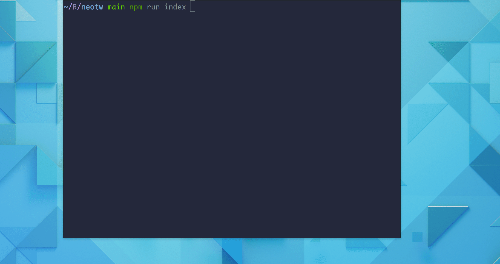
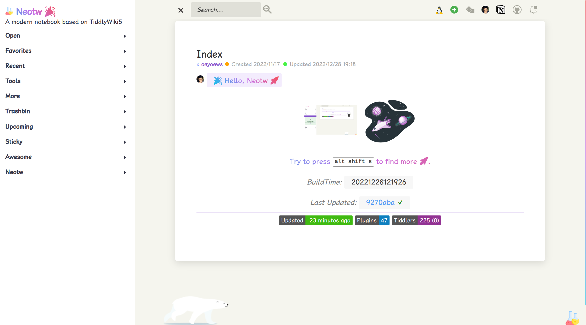
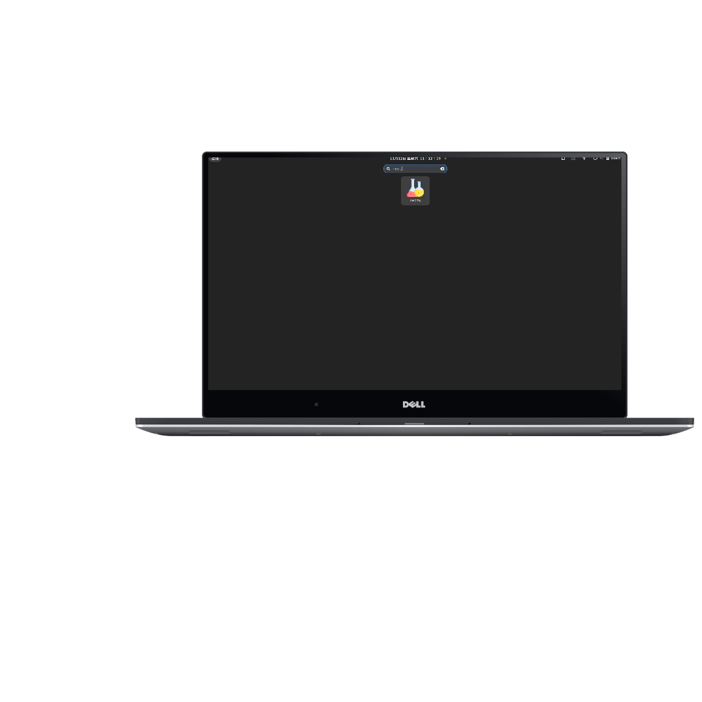

<div align="center">

<h1>Neotw</h1>


</div>

## ❓ What's the neotw

> A modern style notebook based on tiddlywiki is v2 of the [tw5](https://github.com/oeyoews/tw5) repository

> Compare to `tw5`, `neotw` remove github pages deploy and related deploy, no pwa, image optimize, no mobile
> optimize, and Maximize keep vanilla configuration etc, just for local, so it's more simplify, still worth trying

## 🆕 Features

> No longer listed specifically, waiting for your exploration and discovery

## 🖼️ ShowCases

<center>

</center>

<center>


</center>

<!--  -->

## 📂 FileStruct

```bash
📁 neotw
├──📁tiddlers
│   ├──📁builit-plugins
│   └──📁config
└─ 📝tiddlywiki.info
# This structure may not be up to date
```

## ⛹️ Install

```bash
git clone --depth 1 https://gitlab.com/oeyoews/neotw # or git clone --depth 1 https://github.com/oeyoews/neotw
```

## 👟 Run

```bash
yarn install # install
npm run guide # or npx tiddlywiki --listen
```

## 🐥 Configuration(deprecated)

The [makefile](makefile) file is used as the centeral configuration for `neotw`

> more usage please check [makefile](makefile)

## Dev

- [modern-tiddlydev](https://gitlab.com/oeyoews/modern-tiddlydev)

## ✌ Preview

### preview on mobile

- npx http-server

### online

- 🏠 http://oeyoewl.top
- 😺 https://oeyoews.github.io/neotw
- 🦿 https://neotw.tiddlyhost.com
- 🌋 https://neotw.vercel.app
- 🤺 https://neotw.netlify.app/

---

<div align="center">
<div>

</div>
<a target="_blank" href="https://app.netlify.com/sites/neotw/deploys">

 </a>
<a target="_blank" href="https://github.com/oeyoews/neotw/actions/workflows/pages/pages-build-deployment">

 </a>
 <a target="_blank" href="https://github.com/oeyoews/neotw/actions/workflows/release-and-page.yml">

 </a>
 <br>
 <br>


</div>
