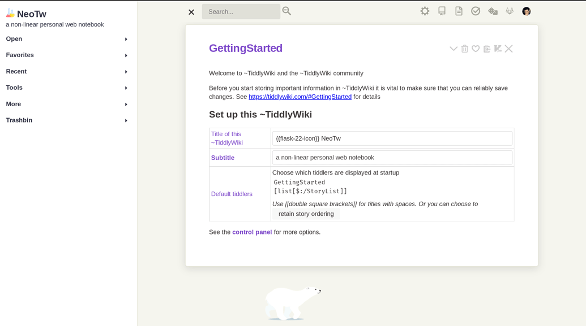

<div align="center">

<h1>neotw</h1>


<hr>


</div>

# TOC

<!-- toc -->

- [What's the neotw](#whats-the-neotw)
- [Features](#features)
- [ShowCases](#showcases)
- [FileStruct](#filestruct)
- [Install](#install)
- [Run](#run)
- [Configuration](#configuration)
- [Preview](#preview)

<!-- tocstop -->

## What's the neotw

> A modern style notebook, is v2 of the [tw5](https://oeyoew.fun) repository

> Compare to `tw5`, `neotw` remove github pages deploy and related deploy, no pwa, image optimize, no mobile
> optimize, and Maximize keep vanilla configuration etc, just for local, so it's more simplify, still worth trying

## Features

> No longer listed specifically, waiting for your exploration and discovery

## ShowCases



## FileStruct

```bash
📁 neotw
├──📁tiddlers
│   ├──📁builit-plugins
│   └──📁config
└─ 📝tiddlywiki.info
```

## Install

```bash
git clone --depth 1 https://gitlab.com/oeyoews/neotw
```

## Run

vanilla

```bash
tiddlywiki --listen
```

make

```bash
make or make run # port is 8099 default
make build # generate dist/index.html
```

> more usage please check [makefile](makefile)

## Configuration

The [makefile](makefile) file is used as the centeral configuration for `neotw`
with this syntax:

<details>
  <summary>makefile</summary>

```makefile
# options
PACKAGE = "TiddlyWiki5"
PKGNAME = "neotw"
CMD = @tiddlywiki
OUTPUTDIR = public
PORT = 8099
USERNAME = $(USER)
HOST = "0.0.0.0"
SERVICECMD = "systemctl"
SERVICETEMPLATEFILE = "neotw-template.service"
SERVICEFILE = "neotw-user.service"
SERVICETARGETFILE = "$(HOME)/.config/systemd/user/$(SERVICEFILE)"
NEOTWBIN = "$(HOME)/.local/bin/$(PKGNAME)"
neotwdir-user= "$(PWD)"

# adjust os, just test on linux
ifeq ($(shell uname),Linux)
	PLATFORM="🐧 Linux"
else
	PLATFORM="😭 Not supported"
endif

# startup tiddlywiki
run:
	@echo "ℹ️  Your current OS is $(PLATFORM) \
		🚀 startup $(PACKAGE)"
	$(CMD) --listen port=$(PORT) anon-username=$(USERNAME) 2>&1 &
# startup to the world
run-to-the-world:
	@echo "👋 startup $(PACKAGE) to the world"
	$(CMD) --listen port=$(PORT) anon-username=$(USERNAME) host=$(HOST)
# generate index.html(support subwiki, but not build html no include subwiki)
# note: because use make, so can't read this `tiddlywiki` cmd from current project, recommend install tiddlywiki global, likw `yarn global add tiddlywiki`
build:
	@make clean
	@echo 🛺 cleaned StoryList
	@mkdir public
	@cp -r tiddlers/ tiddlywiki.info public/
	@rm  -rf public/tiddlers/subwiki public/tiddlers/gtd/ public/tiddlers/trashbin
	$(CMD) public --output dist/ --build index
	@echo "🎉 generated index.html"
# install service
install:
	@echo "tiddlywiki --listen anon-username='anonymous'" > $(NEOTWBIN)
	@chmod +x ~/.local/bin/$(PKGNAME)
	@echo "🎉 installed neotw"
install-service:
	@cp $(SERVICETEMPLATEFILE) $(SERVICEFILE)
	@sed -i "s#neotwdir#$(neotwdir-user)#" $(SERVICEFILE)
	@mv $(SERVICEFILE) $(SERVICETARGETFILE)
	@echo "🎉 $(SERVICETARGETFILE) file has installed"
# changed
reload-service:
	$(SERVICECMD) --user daemon-reload
# use hight color
# maybe should start byhand firstly
enable:
	$(SERVICECMD) enable --user $(SERVICEFILE)
disable:
	$(SERVICECMD) disable --user $(SERVICEFILE)
status:
	$(SERVICECMD) status --user $(SERVICEFILE)
start:
	$(SERVICECMD) start --user $(SERVICEFILE)
	@echo "$(SERVICEFILE) has started, Click this address https://127.0.0.1:$(PORT) to open"
	@make status
restart:
	$(SERVICECMD) restart --user $(SERVICEFILE)
	@echo "$(SERVICEFILE) has restared, Click this address https://127.0.0.1:$(PORT) to open"
	@make status
stop:
	$(SERVICECMD) stop --user $(SERVICEFILE)
	@echo $(SERVICEFILE) has stopped
uninstall:
	rm -i $(NEOTWBIN)
	@echo "👋 $(NEOTWBIN) file has uninstalled"
# uninstall service
uninstall-service:
	@rm -f -i $(SERVICETARGETFILE);
	@echo "👋 $(SERVICETARGETFILE) file has removed"

# clean
.PHONY: clean
clean:
	@rm -rf \
		$(OUTPUTDIR) \
		tiddlers/*__StoryList*.tid
```

</details>

## Preview

- Demo: https://neotw.tiddlyhost.com or https://oeyoews.github.io/neotw
