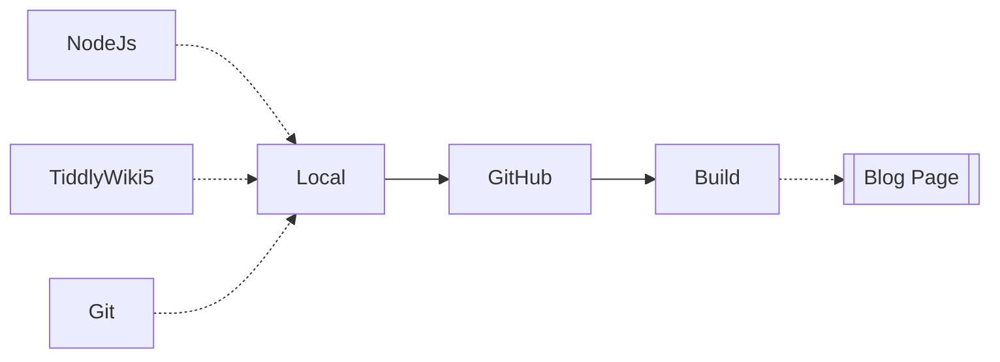
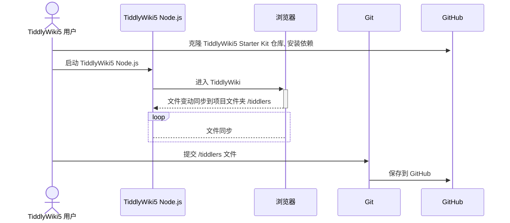

<center>
    
    <!--  -->

|  |  |
|------------------------------------------------------------------------------------------------------------------------------|------------------------------------------------------------------------------------------------------------------------------|
<!--   -->

     

</center>

<hr>

<center>

[Stackblitz Demo](https://stackblitz.com/~/github.com/oeyoews/tiddlywiki-starter-kit) |  [Documentation](https://tiddlywiki-starter-kit.vercel.app/docs/)

</center>

## Features

- 📦 Out of the box: TiddlyWiki Starter Kit comes with most configurations pre-packaged, reducing the need for tedious setup.
- 🎨 Powered by Tailwind CSS: Utilizes Tailwind CSS for responsive design, minimizing the need for extensive style files.
- 📚️ Multiple wiki support: Supports custom folders for different purposes such as work, life, reading, etc., making switching between them effortless.
- 🚀 Quick operations: Provides keyboard shortcuts and full keyboard navigation for efficient workflow.
- 🔧 Simplified configuration: Easily customize the TiddlyWiki Starter Kit by editing the .env file.
- 💡 One-click installation: Quickly install the TiddlyWiki Starter Kit using the npm create create-neotw-app command.

## Requirements

- Node.js(with npm)
- Git(optional)





## Getting Started

<!-- pnpm install --production -->
```bash
npm create neotw-app@latest
```

## Deploy

<!-- https://vercel.com/docs/deploy-button -->
<!-- <a target="_blank" href="https://vercel.com/new/clone?repository-url=https%3A%2F%2Fgithub.com%2Foeyoews%2Ftiddlywiki-starter-kit">
    
</a> -->

[Fork](https://github.com/oeyoews/tiddlywiki-starter-kit/fork) this project, Go to vercel to deploy it manually

> I recommend shallow cloning this project and deploying it manually on Vercel

<!-- folders -->
<!-- ./tiddlywiki.info(1)
./src
    └── tiddlers/
    └── tiddlywiki.info(2.1)
./src-dev
    └── tiddlers/
    └── tiddlywiki.info(2.2) -->