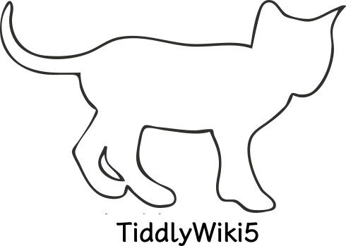

<div align="center">

<h1>Neotw</h1>

<hr>

<!--  -->

</div>

# TOC

<!-- toc -->

- [What's the neotw](#whats-the-neotw)
- [Features](#features)
- [ShowCases](#showcases)
- [FileStruct](#filestruct)
- [Install](#install)
- [Run](#run)
- [Configuration](#configuration)
- [Preview](#preview)

<!-- tocstop -->

## What's the neotw

<span style="float:right;width:156px">

</span>

> A modern style notebook based on tiddlywiki is v2 of the [tw5](https://github.com/oeyoews/tw5) repository

> Compare to `tw5`, `neotw` remove github pages deploy and related deploy, no pwa, image optimize, no mobile
> optimize, and Maximize keep vanilla configuration etc, just for local, so it's more simplify, still worth trying

## Features

> No longer listed specifically, waiting for your exploration and discovery

## ShowCases


## FileStruct

```bash
📁 neotw
├──📁tiddlers
│   ├──📁builit-plugins
│   └──📁config
└─ 📝tiddlywiki.info
# This structure may not be up to date
```

## Install

```bash
git clone --depth 1 https://gitlab.com/oeyoews/neotw # or git clone --depth 1 https://github.com/oeyoews/neotw
```

## Run

vanilla

```bash
tiddlywiki --listen
```

make

```bash
make or make run # port is 8099 default
make build # generate dist/index.html
```

## Configuration

The [makefile](makefile) file is used as the centeral configuration for `neotw`

> more usage please check [makefile](makefile)

## Preview

- gh-pages: https://oeyoews.github.io/neotw
- tiddlyhost: https://neotw.tiddlyhost.com
- vercel: https://neotw.vercel.app
- netlify: https://neotw.netlify.app/

---

<div align="center">
<div>

</div>


</div>
