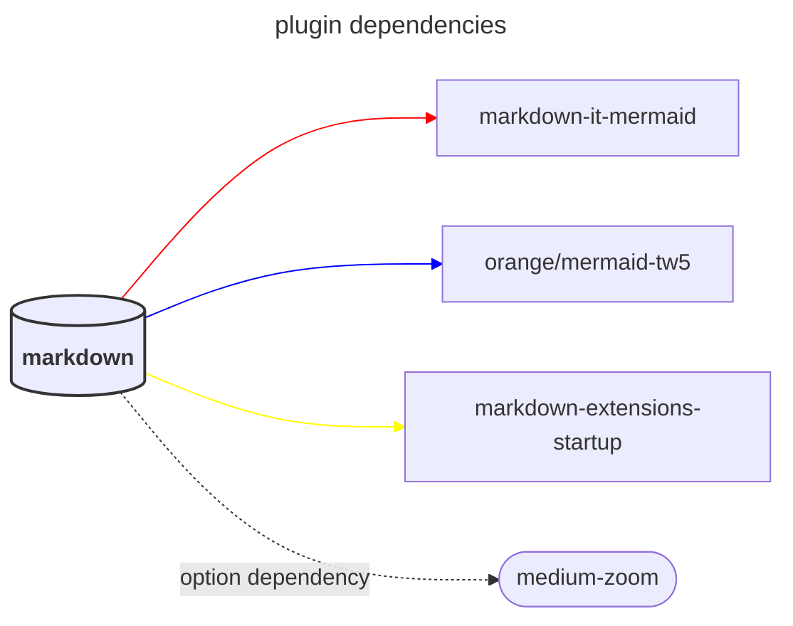

# markdownit mermaid

> 一个 markdownit 的 tiddlywiki mermaid 插件 .

## 在线地址

<TwPlugin name="markdown-it-mermaid" />

> [!NOTE]
> [使用 9.3.0 版本，9.4.0 体积增加了 2MB](https://github.com/orgs/mermaid-js/discussions/4314mermaid), 原因主要是 mindmap 和 flowchart-ejs 使用两个单独的布局引擎 9.4.0 是最后一个 cjs 版本，v10.0.0 以后是 ESM only, 所以 mermid 的库将会固定为 9.3.0，没有更新的必要。GitHub 使用的 mermaid 版本目前是 10.0.2.

<!-- ## Render Type

<$select tiddler="$:/config/markdown-it-mermaid/rendertype" default='svg'><$list filter='[[svg]] [[png]]'>

<option value=<<currentTiddler>>><$view field='title'/></option>
</$list>
</$select> -->

## Features

- support to html(orange/mermaid-tw5 not support)

```mermaid
info
```



## Motivation

Although I can use mermaid through `<$mermaid text="xxx" />` or `$$$$text/vnd.tiddlywiki/mermaid xxxx$$$`, or create a new type of text/vnd.tiddlywiki/mermaid tiddler, but these are not very convenient for me.

And there are some areas in the original mermaid plugin that I would like to improve, but I have not rewritten that plugin. I created a markdown-it-mermaid plugin suitable for tiddlywiki. Fortunately, github also supports this format, so I can not only browse in tiddlywiki, but users on GitHub can also view mermaid


## NOTE

- event: 只有新版支持 click 的写法.
- 渲染成 image 就不支持点击事件
- 旧版不支持 markdown 标记语法，比如加粗斜体
- 旧版不支持一些 class 写法，包括 fontawesome
- 不支持 timeline, quadrantChart
- support svg to zoom: https://github.com/bumbu/svg-pan-zoom
- 渲染成 image, 导致 markdown export 导出爆错，

https://github.com/mermaid-js/mermaid/pull/4734 希望可以类似 echarts 一样，用户可以选择需要的图标类型。

## TODO

- [ ] support v11 with async usage https://github.com/markdown-it/markdown-it/blob/master/docs/development.md#i-need-async-rule-how-to-do-it
