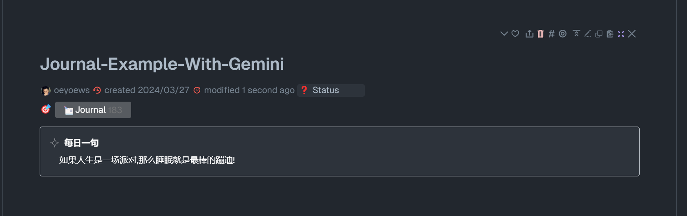

# AI 自动总结文章摘要

> [!TIP]
> 现在同时支持 gemini/spark 两种模型切换!

> [!TIP]
> 借助 gemini api, 自动总结当前 tiddler 的内容，生成 summary 字段.

## 预览

<center>
<video width="600" controls style="border-radius:8px;">
  <source src="/neotw-ai.mp4" type="video/mp4">
</video>
</center>


## 插件在线地址

<TwPlugin name="neotw-ai" />

## 用法

```html
<$neotw-ai model="gemini" />
<$neotw-ai model="spark" />
```

```html
<$neotw-ai-daily />
```

* 以上是 widget 的用法. 会自动总结当前 tiddler 的内容。

* neotw-ai 插件提供了另外一种方便的用法, 仅仅只需在当前 tiddler 添加 `gemini:yes` 的字段内容，即可使用



* neotw-ai-daily widget 会自动为 带有 Journal 的 tiddler 生成一个每日一句，风格为幽默类型，保存在当前 tiddler 的 quote 字段. 如果希望重新生成，删除 quote 字段即可

## 代理

* gemini 目前不支持一些地区国家, 但是可以通过代理来解决，但是仍然还是需要 🪜

```js
// @see: https://zhile.io/2023/12/24/gemini-pro-proxy.html
export default {
  async fetch(request, env) {
    const url = new URL(request.url);
    url.host = 'generativelanguage.googleapis.com';
    return fetch(new Request(url, request))
  }
}
```

## 注意

* 插件依赖有 neotw-vue, tailwindcss. 建议用户直接通过 [CPL](https://tw-cn.netlify.app/#%24%3A%2Fplugins%2FGk0Wk%2FCPL-Repo:%24%3A%2Fplugins%2FGk0Wk%2FCPL-Repo) 插件 安装.
* 插件本身不提供 apikey, 用户需要自己获取 gemini apikey, 目前可以免费在[gemini 官网](https://aistudio.google.com/app/apikey)获取，
* api 会自动保存在 `$:/plugins/oeyoews/neotw-ai/config` 文件的 api 字段上，注意不要上传到公共代码库. 如果你有自己的代理, 可以新增一个 proxy 字段