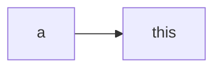

<!-- plugin template readme -->

## tiddlywiki blockquote components

```html
<$blockquote type='markdown' color="red"  number=400>
## TODO
- [ ] todo list
## mermaid test
</$blockquote>

<$blockquote type='wikitext' color="red"  number=400>
!! Heading
* list
</$blockquote>
```

<$blockquote type='markdown' color="red" number=400>

## TODO

- [ ] todo list

## mermaid test



</$blockquote>

<$blockquote type='wikitext' color="red" number=400>
!! Heading

- list
  </$blockquote>
