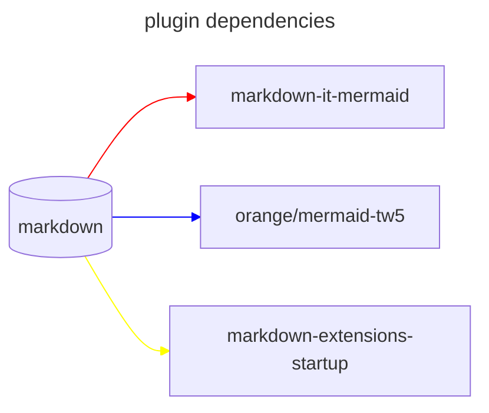

## markdownit mermaid

> [!NOTE]
> mermaid 使用 9.3.0 版本，9.4.0 体积增加了 2MB(但是官方文档没有明确说明增加了什么，没有找到，), 9.4.0 使最后一个 cjs 版本，v10.0.0 以后是 ESM only, 所以 mermid 的库将会固定为 9.3.0，没有更新的必要。

## Features

* support to html(orange/mermaid-tw5 not support)

## Motivation

Although I can use mermaid through `<$mermaid text="xxx" />` or `$$$$text/vnd.tiddlywiki/mermaid xxxx$$$`, or create a new type of text/vnd.tiddlywiki/mermaid tiddler, but these are not very convenient for me.

And there are some areas in the original mermaid plugin that I would like to improve, but I have not rewritten that plugin. I created a markdown-it-mermaid plugin suitable for tiddlywiki. Fortunately, github also supports this format, so I can not only browse in tiddlywiki, but users on GitHub can also view mermaid

## TODO

* https://github.com/mermaid-js/mermaid/issues/4358 v10 以后添加了一个 mermaid.run, 其中有一个 supresserror 选项可以做到这一点，但是由于 esm 的问题，暂时无法升级
* support export to png/svg
* support event
