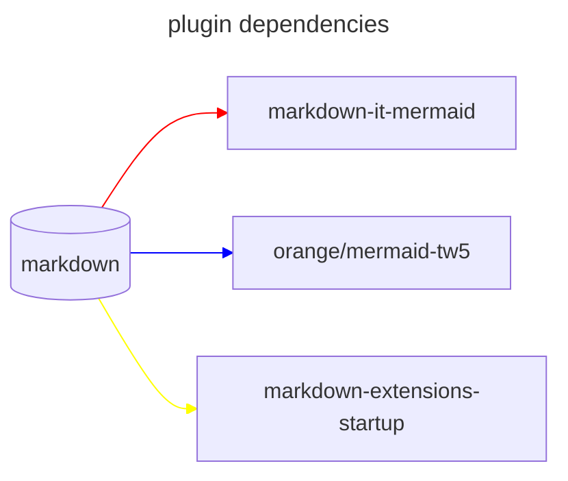

## markdownit mermaid

## Motivation

Although I can use mermaid through `<$mermaid text="xxx" />` or `$$$$text/vnd.tiddlywiki/mermaid xxxx$$$`, or create a new type of text/vnd.tiddlywiki/mermaid tiddler, but these are not very convenient for me.

And there are some areas in the original mermaid plugin that I would like to improve, but I have not rewritten that plugin. I created a markdown-it-mermaid plugin suitable for tiddlywiki. Fortunately, github also supports this format, so I can not only browse in tiddlywiki, but users on GitHub can also view mermaid

